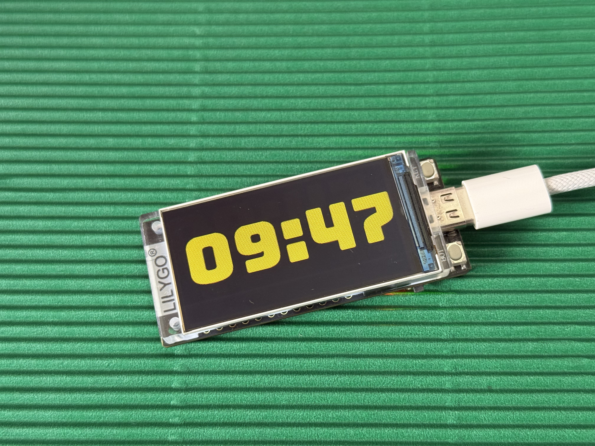

# Bungee Clock for Lilygo T-Display-S3

Clock using the Bungee font.

## Uploading the code

Use [PlatformIO](https://platformio.org/) to upload the code to a [Lilygo T-Display-S3](https://lilygo.cc/products/t-display-s3?variant=42284559827125).

1. First edit `src/user_data.h` and fill in your WiFi access point name, password and timezone.

2. Upload the font to flash:

   PlatformIO sidebar → Project Tasks → clock → Platform → Upload Filesystem Image

3. Then upload the code:

   PlatformIO sidebar → Project Tasks → clock → General → Upload

# Generate font

To generate the .vlw font file from the .ttf file, run `Create_font.pde`. Make sure [Processing](https://processing.org/) is installed.

# Functionality

Button functions

- A: Switch between yellow and grey
- B: Switch between 24 and 12 hour notation

# Project

This project on hackster.io: [Bungee Clock](https://www.hackster.io/edwinm/bungee-clock-a27f51).

